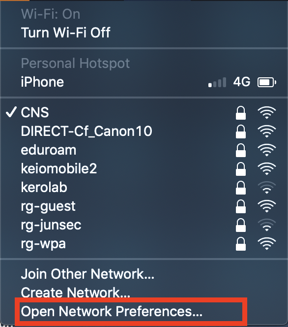
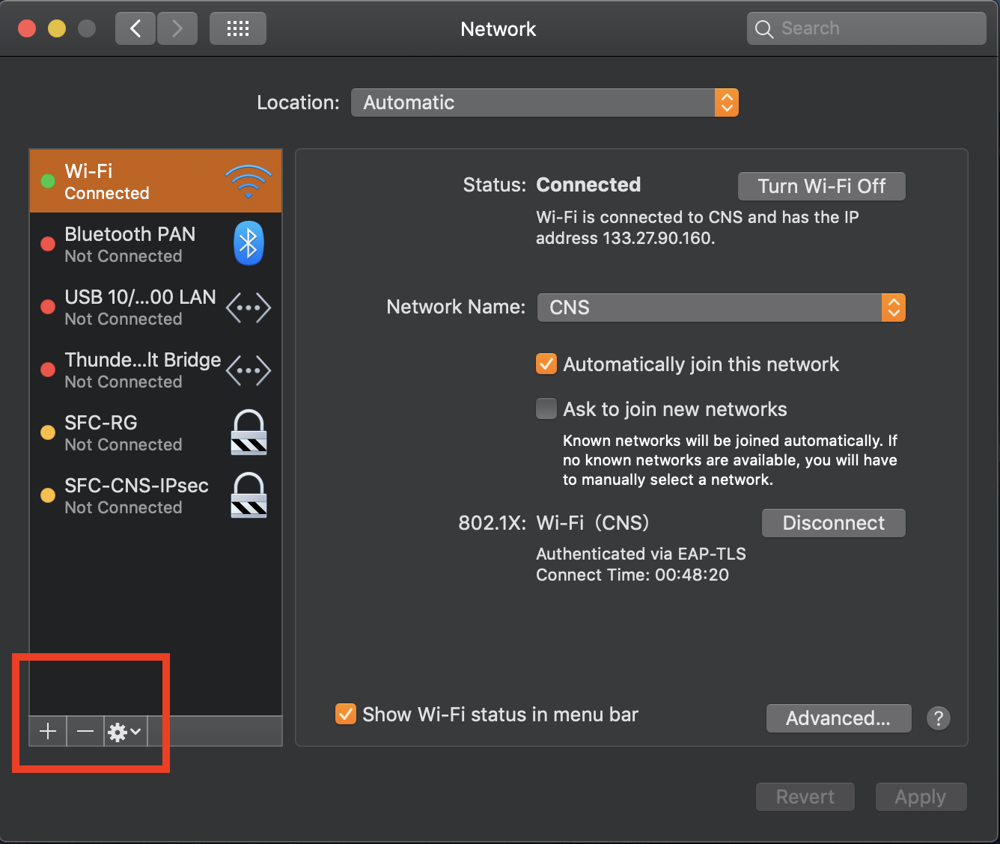
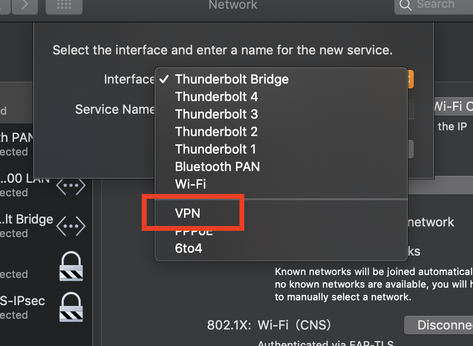
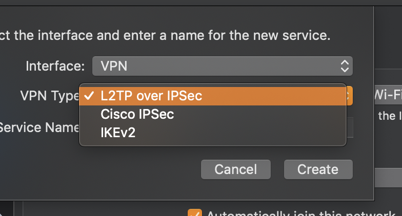
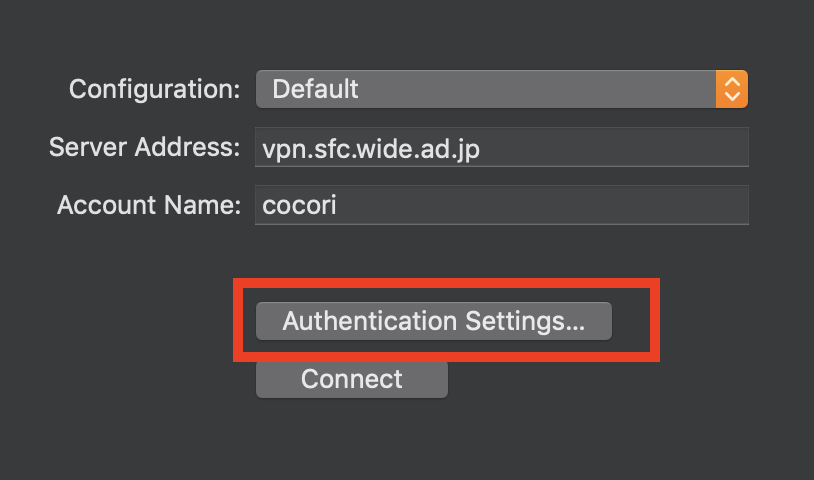
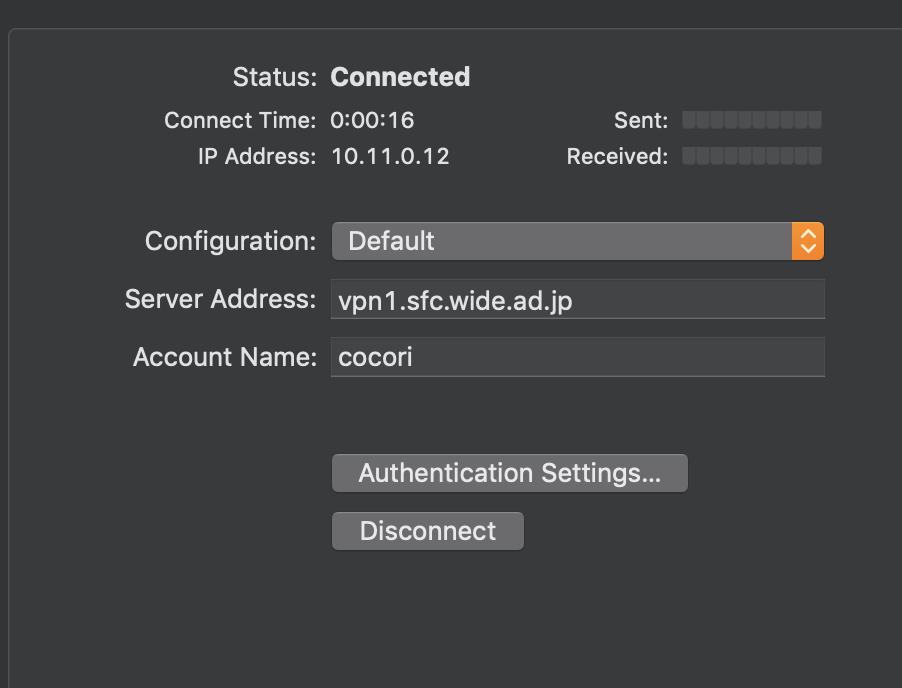

## IPsec for Beginners

AQUA camp 2019ss. 
rum and cocori

---

## Note(注意)

This slide is for explanation of classical cryptography 
これらは全て古典暗号技術の説明です

---

## What is IPsec?(30min)
## Fun hands on! (30min)

<!--
インターネットは、その特性上、途中でデータを盗み読むことも可能
だから、個人情報をそのままインターネット上で転送するのは、非常に危険な行為だといえる
なので、こうした情報はSSL（Secure Socket Layer）という方式によって暗号化してから送信することが多い。
しかし、これらはWebブラウザや電子メール・クライアントといった、特定のアプリケーションでのみ暗号化を行うものであり、汎用性がない。
そこで、アプリケーションに関係なく、すべての通信を自動的に暗号化してしまおうと考えられたのが、今回解説するIPSecである。
IPSecでは、暗号化をIP（Internet Protocol）プロトコルのレベルで行い、ホストごとにセキュリティを確保することを目的としている。
ネットワーク層レベルで自動的に暗号化された通信を行うので、上位のアプリケーションでは暗号化のことを特別に意識する必要はない。
-->

---

## What is IPsec？(1) (15min)
<!-- IPsecを説明する前に、暗号技術の基本とVPNについて確認する必要があることを伝える。-->

- Encrypted communication
- VPN

---

## Cryptosystem  (12min)
<!--
ここで、暗号システムには「暗号化」、「完全性の保証」、「認証」が必要であることとその理由を先に説明。
このあとで、それぞれの目的と手法について少し詳しく説明する。
さらにここで、AliceとBobの図を描いて説明
-->

+++

### Alphabet shift cipher

https://en.wikipedia.org/wiki/Cryptography

+++

### Cryptosystem

<!--
In this procedure, there are three key question.
The first question is ...
1. How to share the key?
And, second question is ...
2. How to encript and decript message?
And third one is ...
3. How to Check whether the message has been altered along the way
and whether you are communicating with the correct partner?
-->
- Key Exchange(鍵交換) |

- Encryption(暗号化) |

- Anthentication(認証) |

+++

### Encryption
<!--
順番が逆になるけど、まずは二種類の暗号化方式について話す。
理由は、鍵の管理方法のが
-->
	
- Symmetric-key cryptography(共通鍵暗号) |

- Public-key cryptography(公開鍵暗号) |

- [Enigma](https://en.wikipedia.org/wiki/Enigma_machine) |

- [One-time pad](https://en.wikipedia.org/wiki/One-time_pad) |

...

+++

### Encryption
<!-- <メモ> -->

The requirement is sharing secret key  
**in some way in advance**

https://www.twilio.com/blog/what-is-public-key-cryptography

+++

### Key Exchange
<!-- ここでは数学的な説明までは踏み込まないことを説明 -->

- [**Diffie-Hellman key exchange**](https://en.wikipedia.org/wiki/Diffie–Hellman_key_exchange)

https://blog.trendmicro.com/trendlabs-security-intelligence/how-exploit-kit-operators-are-misusing-diffie-hellman-key-exchange/

<!-- 素数の使い回しなどによって解読可能性が上がるなどの問題有り -->

- [**QKD**](https://en.wikipedia.org/wiki/Quantum_key_distribution)

+++

### Encryption
<!-- <メモ> -->

https://www.twilio.com/blog/what-is-public-key-cryptography

+++

### Anthentication
	
The act of proving an assertion based on identification information

- data integrity |

+++

### Anthentication
	
- Hash function(ハッシュ関数)

https://microsoftou.com/whats-hash-function/

+++

### Anthentication

https://freecontent.manning.com/cryptographic-hashes-and-bitcoin/

<!--
これだけではdata integrityは保証できるが、正しい相手とcommunicateできているかはどうかは保証できない
そこで、Authentificationを達成するために、HMACやdigital signatureなどの技術がhash fucntionと組み合わせて用いられる。
-->
+++

### Anthentication

**Data integrity(データの完全性)**

- MAC(メッセージ認証符号)

	Based on the Symmetric-key cryptography
	
	Generate: Data + Symmetric-key
	Check : Data + Symmetric-key

- Digital Signature(デジタル署名)
	
	Based on the Public-key cryptography
	
	Generate: Data + Secret-key
	Check : Data + Public-key

---

## VPN  (3min)
<!--
<メモ>
-->

+++

+++

### VPN(Virtual Private Network)
<!--
VPNとは仮想的なプライベートネットワーク接続のことで、セキュアな通信が可能となります。
VPNには閉じられた専用回線を用いる、IP VPNとInternetなどのpublic network上で行うInternet VPNが有ります。
Internet VPNはIP VPNと比較して、費用を削減できます。
そして、このInternet VPNを実現するセキュリティプロトコルが今回紹介する、IPsecです。
-->

Virtual private network connection
- Internet VPN
- IP VPN

https://www.webhostingsecretrevealed.net/the-a-to-z-vpn-guide/
---

### TECHNICAL TERMS

- [情報セキュリティ](https://ja.wikipedia.org/wiki/情報セキュリティ)

	情報の機密性、完全性、可用性を維持すること(情報のCIA)

- [HTTPS](https://ja.wikipedia.org/wiki/HTTPS)

	HTTPS自体はプロトコルではなく、SSL/TLSプロトコルによって提供されるセキュアな接続の上でHTTP通信を行うことをHTTPSと呼ぶ
	
- [SSL/TLS](https://ja.wikipedia.org/wiki/Transport_Layer_Security)

	インターネットなどのコンピュータネットワークにおいてセキュリティを要求される通信を行うためのプロトコル

+++

### TECHNICAL TERMS

- [ディフィー・ヘルマン鍵共有](https://ja.wikipedia.org/wiki/ディフィー・ヘルマン鍵共有)

	事前の秘密の共有無しに、盗聴の可能性のある通信路を使って、暗号鍵の共有を可能にする暗号プロトコル
	
- [QKD (Quantum Key Distribution)]()

+++

### TECHNICAL TERMS

- [共通鍵暗号](https://ja.wikipedia.org/wiki/共通鍵暗号)

	暗号化と復号に同一の(共通の)鍵を用いる暗号方式

- [公開鍵暗号](https://ja.wikipedia.org/wiki/公開鍵暗号)

	暗号化と復号に別個の鍵(手順)を用い、暗号化の鍵を公開できるようにした暗号方式

+++

### TECHNICAL TERMS

- [改竄（かいざん）](https://ja.wikipedia.org/wiki/改竄)

	文書、記録等の全部又は一部が、本来なされるべきでない時期に、本来なされるべきでない形式や内容などに変更されること、すること 
	悪意の有無は問わない
	
- [なりすまし](http://capm-network.com/?tag=認証とは#改ざんとなりすましについて)

	そもそもデータが正規の通信相手から送付されたものかどうかも確認する必要がある

+++

### TECHNICAL TERMS

- [認証(anthentication)](https://ja.wikipedia.org/wiki/認証#Authentication)

	識別情報に基づいて対象の正当性を確認すること

- [データの完全性(data itegrity)](https://ja.wikipedia.org/wiki/データ完全性#情報セキュリティ)

	データが改ざんされることなく妥当であること

+++

### TECHNICAL TERMS

**認証(Authentification)**

- [メッセージ認証符号 (MAC)]()

	データ改ざんの有無を検知するための固定長コード（ビット列）

+++

### TECHNICAL TERMS

**認証方式**

- [HMAC](https://ja.wikipedia.org/wiki/HMAC)
	
	共通鍵と共に用いられる
	ハッシュ関数と共通鍵を組合せて計算するMACのこと

- [デジタル署名](https://ja.wikipedia.org/wiki/デジタル署名)

	公開鍵と共に用いられる
	書面上の手書き署名のセキュリティ特性を模倣するために用いられる公開鍵暗号技術の一種
	[電子署名](https://ja.wikipedia.org/wiki/電子署名)とは異なる

+++

### TECHNICAL TERMS

- [VPN](https://ja.wikipedia.org/wiki/Virtual_Private_Network)

	[インターネット](https://ja.wikipedia.org/wiki/インターネット)に跨って、[プライベートネットワーク](https://ja.wikipedia.org/wiki/プライベートネットワーク)を拡張する技術、およびそのネットワークのこと

+++

### TECHNICAL TERMS

- インターネットVPN

	インターネット回線を利用するVPN
	- IPsec-VPN
	セキュリティプロトコルにIPsecを使用したインターネットVPNのこと
	 
	- SSL-VPN
	セキュリティプロトコルにSSLを使用したインターネットVPNのこと

- IP VPN

	- MPLS-VPN
	通信事業者のプライベートIP網内で経路情報の探索にMPLSを採用したVPNのこと

+++

### TECHNICAL TERMS

- [用語](url)

	説明

---

### Reference So Far

- [IPsecをはじめから](https://www.infraexpert.com/study/study10.html)
	- [VPN（ Virtual Private Network ）とは](https://www.infraexpert.com/study/ipsec.html)
	- [VPN - VPNの基礎知識](https://www.infraexpert.com/study/ipsec2.html)
	- [VPN - 暗号システムの概要](https://www.infraexpert.com/study/ipsec3.html)
	- [VPN - 共通鍵暗号と公開鍵暗号](https://www.infraexpert.com/study/ipsec4.html)

- [IT管理者のためのIPSec講座](https://www.atmarkit.co.jp/ait/articles/0011/27/news001_2.html)

+++

### Reference So Far

- [情報セキュリティ Capn Network](http://capm-network.com/?tag=%E6%83%85%E5%A0%B1%E3%82%BB%E3%82%AD%E3%83%A5%E3%83%AA%E3%83%86%E3%82%A3)
	
	- [鍵配送問題 Capn Network](http://capm-network.com/?tag=%E9%8D%B5%E9%85%8D%E9%80%81%E5%95%8F%E9%A1%8C)
	- [暗号通信 Capm Network](http://capm-network.com/?tag=%E6%9A%97%E5%8F%B7%E9%80%9A%E4%BF%A1)
	
	- [ハッシュ関数 Capn Network](http://capm-network.com/?tag=%E3%83%8F%E3%83%83%E3%82%B7%E3%83%A5%E9%96%A2%E6%95%B0)
	- [メッセージ認証コード Capn NetWork](http://capm-network.com/?tag=%E3%83%A1%E3%83%83%E3%82%BB%E3%83%BC%E3%82%B8%E8%AA%8D%E8%A8%BC%E3%82%B3%E3%83%BC%E3%83%89)
	- [デジタル署名とデジタル証明書 Capn Network](http://capm-network.com/?tag=%E3%83%87%E3%82%B8%E3%82%BF%E3%83%AB%E7%BD%B2%E5%90%8D%E3%81%A8%E3%83%87%E3%82%B8%E3%82%BF%E3%83%AB%E8%A8%BC%E6%98%8E%E6%9B%B8)
	
	

- [What is Public Key Cryptography? - Twilio](https://www.twilio.com/blog/what-is-public-key-cryptography)

---

## What is IPsec？(2) (10min)
<!--
IPsecは暗号化通信を実現するための複数のプロトコルの総称
ここではモードと中核をなすいくつかのプロトコルについて紹介する
-->

- SA(Security Association)
- IKE(Internet Key Exchange)
- ESP(Encapsulated Security Payload), AH(Authentication Header)
- トランスポートモード、トンネルモード

- IKE vs IPsec AH/ESP
- Basic idea of a tunnel
- SAs & rekeying

+++

### IPsec
<!--
<メモ>
-->
**Layer**

+++
### IPsec Transport and Tunnel Mode

+++

### IPsec AH ESP
<!--
AH is used to authenticate – but not encrypt
ESP provides encryption and optional authentication
-->
- AH

	パケットが改ざんされていないかどうか認証を行う。(HMAC)
	パケットの暗号化はできない。

- ESP

	パケットが改ざんされていないかどうか認証を行う。(HMAC)
	パケットのペイロード部の暗号化 ( DES or 3DES or AES ) を行う。

+++

### SAs(Security Associations)

+++

### Rekeying

---

### TECHNICAL TERM

- [通信プロトコル](https://ja.wikipedia.org/wiki/通信プロトコル)

	[ネットワーク](https://ja.wikipedia.org/wiki/コンピュータネットワーク)上での通信に関する規約を定めたもの
	
- [IP (Internet Protocol)](https://ja.wikipedia.org/wiki/Internet_Protocol)

	最も基本的な通信単位であるパケットを相手に送信するための通信プロトコル

- [IP adress](https://ja.wikipedia.org/wiki/IPアドレス)

	IPにおいてパケットを送受信する機器を判別するための番号のこと

+++

### TECHNICAL TERMS

- [OSI参照モデル](https://ja.wikipedia.org/wiki/OSI参照モデル)

	コンピュータの持つべき通信機能を階層構造に分割したモデルのこと

---

### Reference So Far

- [IPsec - SA ( Security Association )](https://www.infraexpert.com/study/ipsec7.html)

- [IT管理者のためのIPSec講座](https://www.atmarkit.co.jp/ait/articles/0011/27/news001_2.html)

- [Introduction to IP Security (IPSec) - Cisco](https://www.cisco.com/c/en/us/td/docs/wireless/asr_5000/20/IPSec/b_20_IPSec/b_20_IPSec_chapter_01011.pdf)

---

### Hands-on

[This](https://drive.google.com/open?id=15dCljthLrtDskK0bEveo6B9Y4XRDQBoQ) is a simple hands-on.  
Please access here with your keio.jp

+++

### Try VPN!

First, let's use VPN.
If you have already used VPN, you don't need to setup.  
If you don't have any VPN settings, let's make VPN settings.  

+++

### Try VPN!

Open your network preference.

+++

### Try VPN!

+++

### Try VPN!

+++

### Try VPN!

+++

### Try VPN!

+++

### Try VPN!

---

### What is IPsec？(Conclusion)

- アプリケーションに関係なく、全ての通信を自動的に暗号化するためのIP Security Protocol |

- VPN構築の際に利用されるもの |

---

### Reference 
